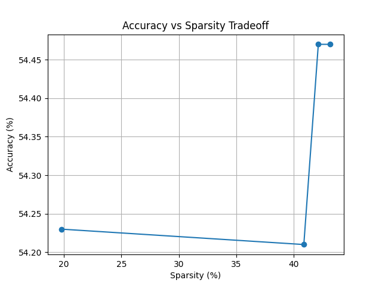
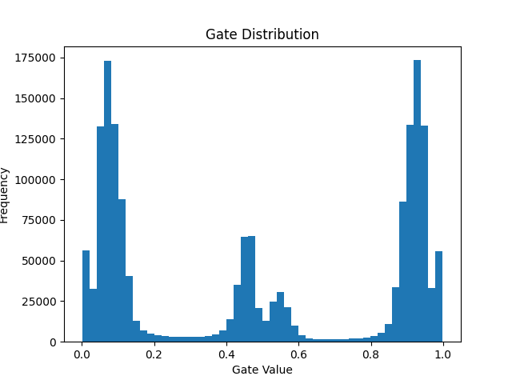

# 🧠 Self-Pruning Neural Network (CIFAR-10)

## 📌 Overview

This project implements a **self-pruning neural network** that learns to remove unnecessary weights during training.

Each weight is associated with a **learnable gate (value between 0 and 1)**, allowing the model to automatically decide whether to keep or prune that connection.

The goal is to study the **trade-off between model sparsity and accuracy**.

---

## ⚙️ Methodology

### 🔹 Prunable Layer

A custom layer `PrunableLinear` is implemented where each weight is multiplied by a learnable gate:

```
gate = sigmoid(gate_score)
pruned_weight = weight × gate
```

* Gate ≈ 0 → weight is pruned
* Gate ≈ 1 → weight is kept

---

### 🔹 Loss Function

The total loss is:

```
Loss = CrossEntropy + λ × SparsityLoss
```

* **CrossEntropy** → classification objective
* **SparsityLoss** → encourages pruning
* **λ (lambda)** → controls how aggressively pruning happens

---

### 🔹 Sparsity Mechanism

We use:

```
SparsityLoss = mean(gate × (1 - gate))
```

This pushes gates toward:

* **0 (remove weight)**
* **1 (keep weight)**

---

## 📊 Results

| Lambda | Accuracy (%) | Sparsity (%) |
| ------ | ------------ | ------------ |
| 0      | 54.23        | 19.77        |
| 0.05   | 54.21        | 40.87        |
| 0.1    | 54.47        | 42.13        |
| 0.2    | 54.47        | 43.17        |

---

## 📈 Accuracy vs Sparsity Tradeoff



### 🔍 Observations

* Increasing λ increases sparsity significantly
* Accuracy remains almost constant (~54%)
* Indicates many weights are redundant

---

## 📉 Gate Distribution



### 🔍 Observations

* Large peak near **0** → pruned weights
* Large peak near **1** → important weights
* Small region near **0.5** → uncertain weights

---

## 🧠 Analysis

* The model successfully learns **which weights to prune**
* Achieves ~**2× increase in sparsity** with **minimal accuracy loss**
* Demonstrates that neural networks contain **redundant parameters**

### ⚠️ Limitation

* Sparsity plateaus around **40–43%**
* Model avoids further pruning to preserve accuracy
* Some gates remain in intermediate states

---

## 🚀 Key Insights

* Self-pruning enables **automatic model compression**
* Moderate λ (~0.05–0.1) gives best trade-off
* Aggressive pruning can reduce performance

---

## 🔮 Future Improvements

* Temperature scaling for sharper gate decisions
* Hard threshold pruning after training
* Structured pruning (filters/channels)
* Applying to CNN architectures (ResNet, etc.)

---

## 🛠️ Tech Stack

* Python
* PyTorch
* Torchvision
* Matplotlib

---

## 📂 Project Structure

```
self-pruning-nn/
│
├── model.py
├── utils.py
├── train.py
├── accuracy_vs_sparsity.png
├── gate_distribution.png
└── README.md
```

---

## ▶️ How to Run

```
python train.py
```

---

## 🎯 Conclusion

This project demonstrates a practical implementation of a **self-pruning neural network**, showing how models can learn to reduce their own complexity while maintaining performance.

---
